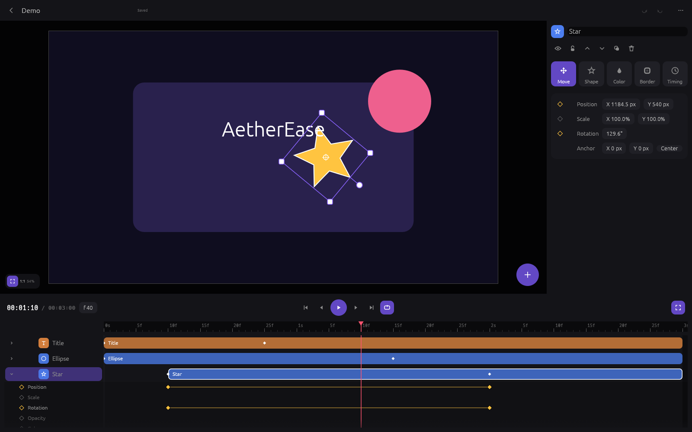
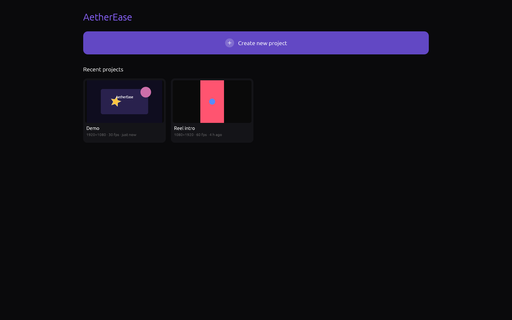
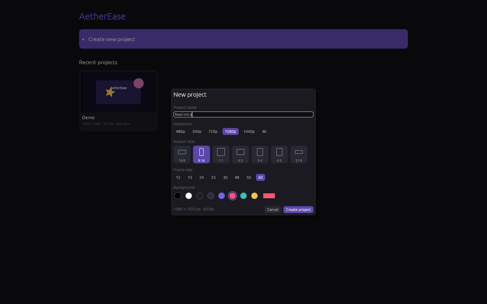

# AetherEase

A motion graphics editor for the desktop, written in Rust. AetherEase aims to
bring Alight Motion's approachable layer-and-keyframe workflow to Windows and
grow into a real alternative to After Effects.



| Home | New project |
|---|---|
|  |  |

## What works today

- **Home screen**: one button to create a project and a grid of recent
  projects with live thumbnails. Right-click a project to remove it from the
  list.
- **New project dialog** like Alight Motion's: name, resolution (480p to 4K),
  aspect ratio (16:9, 9:16, 1:1, 4:3, 3:4, 4:5, 21:9), frame rate and
  background colour.
- **Autosave**: new projects are saved to your projects folder
  (`%APPDATA%\AetherEase\projects` on Windows) and every change is saved
  automatically a moment after you make it.
- **Editor layout** modelled on Alight Motion and adapted for desktop: a
  slim top bar (back to home, project name, undo/redo, a "more" menu), the
  canvas with a round **+** button for adding layers, a property panel on the
  right organised as icon pages (Move, Shape/Text/Image, Color, Border,
  Timing), and the timeline along the bottom with centred playback controls.
- **Layers**: rectangles (with rounded corners), ellipses, triangles,
  polygons, stars, text, and imported images (PNG, JPEG, WebP, BMP, GIF).
- **Canvas editing**: click to select, drag to move, corner handles to scale
  (Shift for uniform), top handle to rotate (Shift snaps to 15°). Scroll to
  zoom, middle or right drag to pan.
- **Keyframes** on position, scale, rotation, opacity, colour, size, corner
  radius, and border. Click a property's diamond to add a key; once a property
  has keys, editing it at another frame adds a key there automatically.
  Easing per key: linear, ease in, ease out, ease in & out, hold.
- **Timeline**: scrub on the ruler, drag layer bars to move them in time
  (keys move with them), drag bar edges to trim, expand a layer to see and
  drag its keys, right-click a key for easing or delete. Ctrl+scroll zooms.
- **Playback** at the project frame rate, with loop.
- **Project settings**: resolution presets (16:9, 9:16, 1:1, 4K...), frame
  rate, duration, background colour.
- **Undo/redo**, duplicate, reorder, show/hide, lock.
- **Save and open** projects as `.aether` files (JSON). Try
  `examples/demo.aether`.

## Build and run

Install Rust from <https://rustup.rs>, then:

```sh
cargo run --release                         # empty project
cargo run --release -- examples/demo.aether # open the demo
```

On Windows this produces a native `aetherease.exe` using DirectX 12 or Vulkan
through wgpu. CI builds a Windows release binary for every pull request.

## Shortcuts

| Keys | Action |
|---|---|
| Space | Play / pause |
| ← / → | Previous / next frame |
| Home / End | First / last frame |
| Delete | Delete the selected keyframe, or the selected layer |
| Ctrl+D | Duplicate layer |
| Ctrl+Z, Ctrl+Y / Ctrl+Shift+Z | Undo, redo |
| Ctrl+N, Ctrl+O, Ctrl+S, Ctrl+Shift+S | New project, open, save, save as |
| Esc | Deselect |

## Code layout

| Path | What it holds |
|---|---|
| `src/model/anim.rs` | `Animated<T>` values, keyframes, easing |
| `src/model/mod.rs` | `Project`, `Layer`, layer kinds, JSON save format |
| `src/render.rs` | Draws layers, transforms, hit testing, image textures |
| `src/history.rs` | Snapshot-based undo/redo |
| `src/app.rs` | Screens, editor state, file handling, autosave, shortcuts, playback |
| `src/recent.rs` | Recent projects list and the projects folder |
| `src/ui/` | Home screen and new project dialog, menu and toolbar, canvas viewport, inspector, timeline |

The UI is built with [egui](https://github.com/emilk/egui)/eframe. The preview
is drawn with egui's painter for now; a dedicated renderer (for export,
effects and masks) is the next big piece.

## Roadmap

- Video export (MP4/GIF/PNG sequence) through an offscreen renderer
- Effects (blur, glow, shadow), masks, blend modes
- Graph editor for custom bezier easing
- Parenting and grouping
- Audio layers
- Lottie and Alight Motion project import
